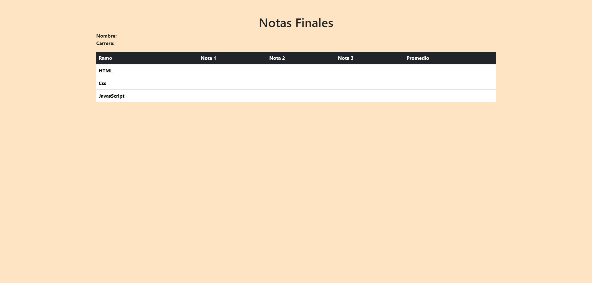

# Desafio Guiado - Notas Finales

Este proyecto muestra las notas finales de un estudiante en los ramos de HTML, CSS y JavaScript. La página está diseñada para presentar las notas individuales y el promedio de cada ramo de manera clara y ordenada.

## Descripción

La página de "Notas Finales" utiliza HTML, CSS y JavaScript, con el apoyo de Bootstrap para el diseño. Los datos de las notas se muestran en una tabla, con campos listos para ser llenados dinámicamente a través de JavaScript.

## Vista Codificada

A continuación, se muestra la imagen del resultado codificado:

## Estructura del Proyecto

El proyecto está organizado de la siguiente manera:

- **Cabecera (`<head>`)**: Contiene los metadatos, la referencia a Bootstrap y la hoja de estilos personalizada.
- **Cuerpo (`<body>`)**:
  - **Contenedor Principal (`
`)**: Contiene el título y la descripción del estudiante.
  - **Definición de Datos (`<dl class="row">`)**: Espacio para los datos del estudiante, como Nombre y Carrera.
  - **Tabla de Notas (`<table class="table">`)**: Muestra las notas de los ramos HTML, CSS y JavaScript, así como sus respectivos promedios.

## Tecnologías Utilizadas

- HTML5
- CSS3
- Bootstrap 5.3.2
- JavaScript
- jQuery 3.7.1

## Autor

Este proyecto fue desarrollado por **Valeria Torrealba**.